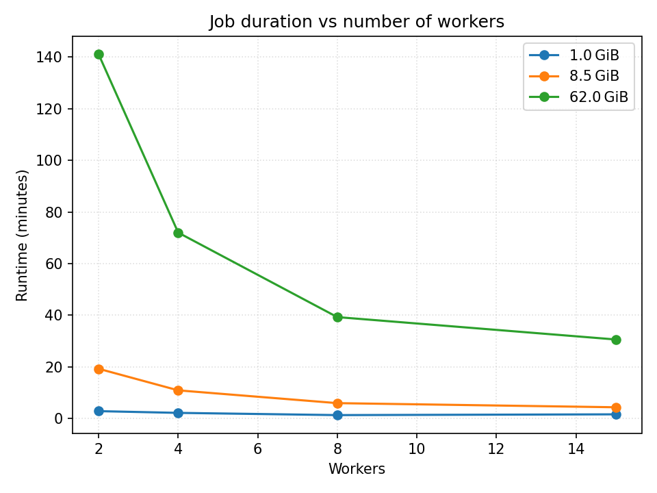
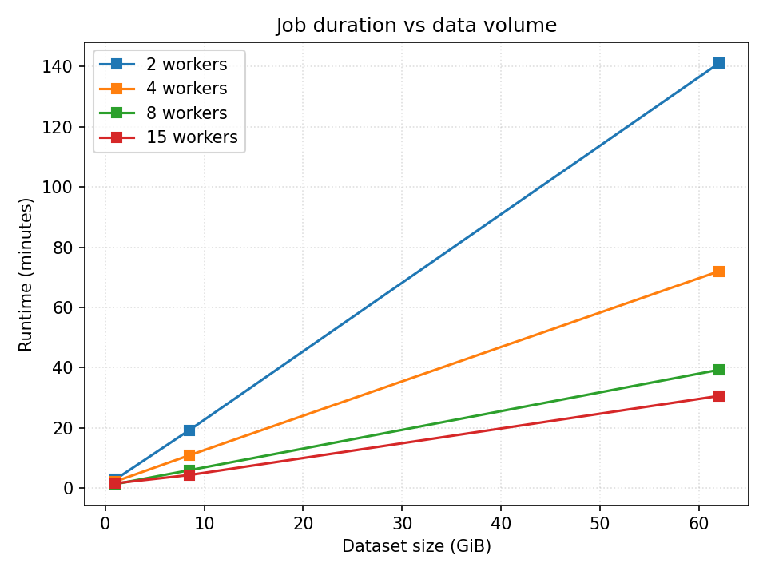

# 🚀 Distributed Retinal Image Processing with Apache Spark on Google Cloud Dataproc 
 
A scalable PySpark pipeline for processing large-scale retinal image datasets (e.g., EyePACS) in parallel. Each worker applies OpenCV filters (CLAHE, adaptive thresholding, morphology) per image, batches results into TAR archives (256 MiB chunks), and streams them back to Cloud Storage with resumable uploads. 
 
## 🔍 Project Structure 
 
```
.
├── infra/
│   ├── dataproc_cluster.yaml       # Snapshot of Dataproc cluster settings
│   └── terraform/                  # (Optional) Terraform scripts
│
├── src/
│   ├── main.py                     # PySpark + mapInPandas implementation
│   ├── requirements.txt            # Python dependencies
│   └── submit_dataproc.sh          # Helper script to submit the job
│
├── graphs/
│   ├── runtime_vs_workers.png      # Runtime scaling graph
│   └── throughput_stages.png       # Throughput breakdown graph
│
└── README.md                       # This file
```
 
## 🌟 Features 
 
- **Managed Spark** via Dataproc (no manual cluster setup)   
- **Direct GCS I/O**: read raw images & stream TAR uploads without HDFS   
- **Partition-parallel UDF**: each CPU core processes many "slices" of the dataset   
- **In-memory TAR batching**: 256 MiB flush, 8 MiB resumable-upload chunks   
- **Robust OpenCV pipeline**:   
  1. CLAHE on green channel   
  2. Grayscale conversion   
  3. Adaptive thresholding   
  4. Morphological cleanup   
 
## ⚙️ Prerequisites 
 
1. **Google Cloud project** with billing enabled   
2. **gcloud** CLI installed & authenticated   
3. **Service account** with roles:   
   - `roles/dataproc.editor`   
   - `roles/storage.objectAdmin`   
4. **GCS bucket**, e.g. `gs://retinal_images_01`, with two prefixes:   
   - `sample/` (input images)   
   - `output/` (batch TAR archives)   
 
## 🚀 Quickstart 
 
1. **Create the Dataproc cluster**   
   ```bash 
   gcloud dataproc clusters create image-cluster \
     --region=us-central1 \
     --master-machine-type=n4-standard-2 \
     --worker-machine-type=n4-standard-2 \
     --num-workers=3 \
     --worker-boot-disk-size=100 \
     --properties spark.executor.memory=2g,spark.executor.memoryOverhead=768m,...
   ``` 
 
2. **Install dependencies**   
   ```bash 
   pip install -r src/requirements.txt 
   ``` 
 
3. **Submit the job**   
   ```bash 
   bash src/submit_dataproc.sh \
     --cluster image-cluster \
     --region us-central1 \
     --input gs://retinal_images_01/sample/ \
     --output gs://retinal_images_01/output/ 
   ``` 
 
4. **Monitor progress**   
   - Spark UI via Google Cloud Console   
   - Logs via Cloud Logging (`resource.type="spark_job"`) 
 
## 📊 Performance 
 
- **Dataset**: ~62 GB of retinal images   
- **Clusters tested**: 4, 8, and 15 workers   
- **Observation**: Near-linear speed-up up to ~15 workers; plateaus thereafter (Amdahl's Law). 
 
   
   
 
## 🏗️ Architecture Overview 
 
```
gs://sample/ → Spark driver → repartition(N) →  
   └─ Worker nodes (OpenCV → TAR batching → upload) → gs://output/ 
```
 
- **Partitions** = `defaultParallelism × 8` ensures CPUs stay busy despite I/O stalls. 
 
## 🔮 Next Steps 
 
- Integrate diabetic-retinopathy classification model   
- Enable autoscaling based on queued partitions   
- Build real-time monitoring dashboards   
- Explore GPU-accelerated Dataproc clusters   
 
## 🤝 Contributors 
 
- Pushkar Wani   
- Zackary Amo   
- Alexander Li   
 
